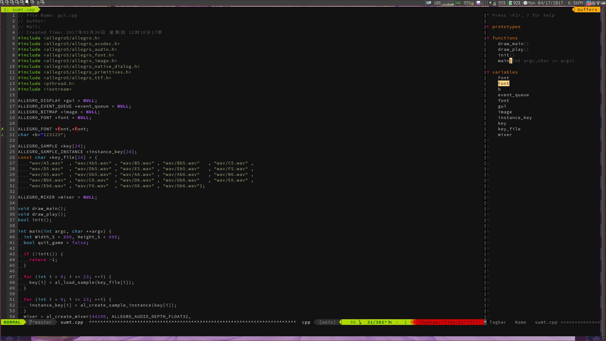

# Vim 配置

###  简易安装
**wget -qO- https://raw.github.com/VZIKL/vimrc/master/setup.sh | sh -x**

####   快捷键
1. C-i编译
2. kj=ESC
3. H=^,L=$ 普通模式下H和L移动到行首和行尾
4. 命令行中 C-a到行首 C-e到行尾
5. C-x 改变普通模式下左侧行号
6. F3=NerdTree F8=Tagbar
7. F6打开,关闭文件高亮
8. C-w C-h,j,k,l 切换窗口
9. U=C-r
10. C-p 查找文件

###  插件列表
- Vundle
- NerdTree
- Vim-airline
- Tagbar
- Snimapte
- CoVim
- Ctrlp
- YouCompleteMe
- Vim-instant-markdown
- Auto-Pairs
- Vim-Colors-Solarized
- .....

